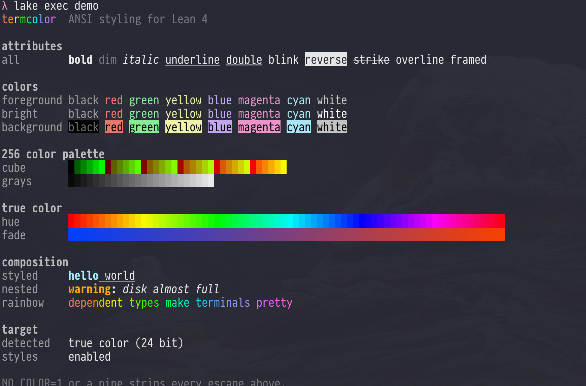

# termcolor

[](https://github.com/jonaprieto/lean-termcolor/actions/workflows/ci.yml)
[](lean-toolchain)
[](LICENSE)

ANSI colors and styled text for Lean 4.

`termcolor` keeps styled output as pure data. It supports the standard ANSI colors, bright
colors, the xterm 256-color palette, RGB colors, backgrounds, and common text attributes. The
core has no terminal IO; import `TermColor.Detect` for environment-based target selection and
printing.

## Install

Add the package to `lakefile.toml`:

```toml
[[require]]
name = "termcolor"
git = "https://github.com/jonaprieto/lean-termcolor"
rev = "main"
```

## Quick start

```lean
import TermColor
import TermColor.Detect

open TermColor
open scoped TermColor.Style

def message : Text :=
  Text.styled "ready" (Style.bold <+> Style.green)

#eval Text.render RenderTarget.ansi16 message

def main : IO Unit :=
  TermColor.print message
```

For deterministic output, render the same value with an explicit target:

```lean
#eval Text.render RenderTarget.plain message
#eval Text.render RenderTarget.ansi16 message
```

Here is the demo output in a terminal:



Use `Text.render` when the output target is known. Import `TermColor.Detect` and use
`TermColor.print` when the library should choose a target from the environment.

## API at a glance

- `Color.red`, `Color.brightBlue`, `Color.indexed 196`, `Color.rgb 255 127 0`, and
  `Color.default` describe colors independently of a terminal.
- `ColorScheme.catppuccin`, `ColorScheme.dracula`, and `ColorScheme.monokai` provide semantic
  palettes for terminal UIs.
- `Style.bold <+> Style.red` composes SGR settings from left to right. Composition is associative,
  `Style.empty` is its identity, and the rightmost setting wins when settings overlap.
- `Text.styled "warning" Style.yellow ++ Text.plain "!"` preserves text order and style
  boundaries.
- `RenderTarget.plain`, `.ansi16`, `.ansi256`, and `.trueColor` make fallback behavior explicit.

RGB fallback uses the conventional xterm palette. A terminal may let users redefine that palette,
so exact RGB output requires `RenderTarget.trueColor`.

## Automatic output

`TermColor.Detect` is conservative: redirected output is plain by default, while active terminals
receive ANSI output. It respects the standard `NO_COLOR` and `FORCE_COLOR` conventions, and
`ColorChoice.always` and `.never` are explicit overrides.

Pass an explicit `RenderTarget` when the caller knows more about the destination than environment
detection can determine.

## Build and development

The runtime library has no external dependencies. `TermColor.Properties` keeps machine-checked API
properties out of the runtime build and does not require mathlib.

```sh
lake build TermColor TermColor.Properties demo
lake exe demo
```

The stack is split into focused packages: [`termcolor-layout`](https://github.com/jonaprieto/lean-termcolor-layout)
for display width and layout, [`termcolor-widgets`](https://github.com/jonaprieto/lean-termcolor-widgets)
for pure CLI widgets, and [`termcolor-terminal`](https://github.com/jonaprieto/lean-termcolor-terminal)
for terminal control and live IO.

## License

Apache-2.0.
