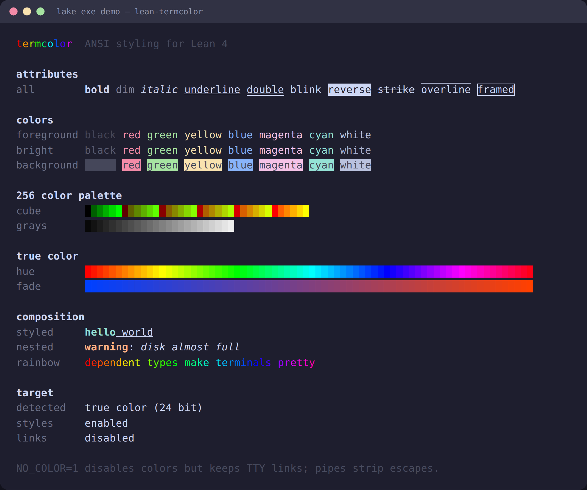

# termcolor

[](https://github.com/jonaprieto/lean-termcolor/actions/workflows/ci.yml)
[](https://github.com/jonaprieto/lean-termcolor/releases)
[](lean-toolchain)
[](https://jonaprieto.github.io/lean-termcolor/)
[](LICENSE)

ANSI colors and styled text for Lean 4. `Text` is pure data; terminal IO is provided by the
optional detection and terminal packages.

<p align="center"></p>

## Install

```lean
require termcolor from git
  "https://github.com/jonaprieto/lean-termcolor.git" @ "v1.1.2"
```

## Quick start

```lean
import TermColor
import TermColor.Detect

open TermColor
open scoped TermColor.Style

def message : Text := Text.styled "ready" (Style.bold <+> Style.green)

#eval Text.render RenderTarget.plain message
#eval Text.render RenderTarget.ansi16 message
```

`Color`, `Style`, `ColorScheme`, `Text.render`, and OSC-8 hyperlinks are pure. `TermColor.Detect`
selects a target from terminal capabilities, `NO_COLOR`, `FORCE_COLOR`, and `TERM`.

## Build

```sh
lake build TermColor TermColor.Properties demo
lake exe demo
```

## Related projects

[`termcolor-layout`](https://github.com/jonaprieto/lean-termcolor-layout) provides layout;
[`termcolor-widgets`](https://github.com/jonaprieto/lean-termcolor-widgets) provides pure views;
[`termcolor-terminal`](https://github.com/jonaprieto/lean-termcolor-terminal) provides terminal IO.

## License

Apache-2.0.
